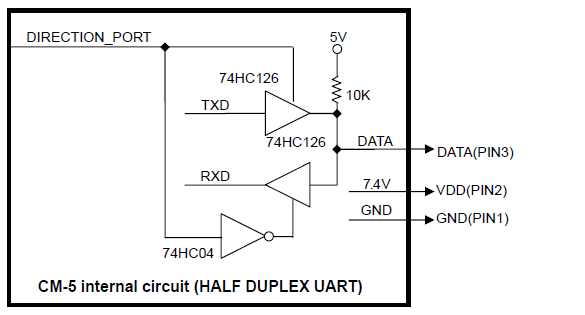
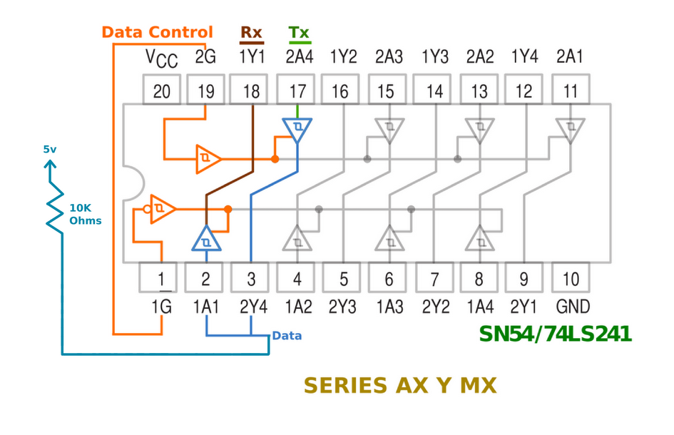

# Hardware Interface

The xl-320 servos use a half duplex, single master, multi-slave
serial interface between all of the servos. There are multiple designs on the interweb
you can build (or buy) to connect a computer or microcontroller to the servos.

## Robotis Suggested

This uses a 74HC126 tri state buffer to interconnect the data line with a standard uart.
To switch betwen the Tx and Rx signals, a third signal (direction port) is used. In my
software, I use the `pyserial` RTS signal for the direction signal. **Unfortunately, 
not all USB serial interfaces breakout the RTS pin**

## 74LS241 Interface

I have used the [74LS241](http://savageelectronics.blogspot.com/2011/01/arduino-y-dynamixel-ax-12.html)
to talk to the xl-320. This has a higher pin count, but the NOT is included in the chip. It works, but 
requires the extra RTS pin of the serial port to toggle direction.

## Pixl

The [Poppy Project](https://www.poppy-project.org) designed an ingenious board call [Pixl](https://github.com/poppy-project/pixl)
that allows a standard uart (without the extra direction pin) to talk to the servos.
This is the hardware design I am currently using.

I am currently using a 74AHCT126 tri-state buffer with a Vcc of 5V. I plan to find
a 3.3V buffer that is 5V tolerant (maybe 74LVX126) and remove my current need for
a logic level converter.

Now, this is more than an interface, it also produces all of the necessary voltages
(3.3V, 5V, and 7.5V) needed to talk to the servo. I use this one for debugging and
software development of `pyxl320` when I am on my Macbook. 

## What Happened to the Raspberry Pi GPIO Version

An earlier version of my library used the RPi's GPIO pin 17 as the direction pin when
I used the 74LS241 chip above. It worked, but once I switched the Pixl interface, it
became redundant. Since I didn't need it any more, I removed it. If you use a standard
USB-to-serial converter or the RPi's uart, **you don't need GPIO if you use the Pixl
circuit** shown above.

# References

- [Mosfet logic level converter tutorial](https://learn.sparkfun.com/tutorials/bi-directional-logic-level-converter-hookup-guide)
- [Adjustable voltage calculator](http://www.reuk.co.uk/wordpress/electric-circuit/lm317-voltage-calculator/)

---

	
	 This work is licensed under a <a rel="license" href="http://creativecommons.org/licenses/by-sa/4.0/">Creative Commons Attribution-ShareAlike 4.0 International License</a>.

