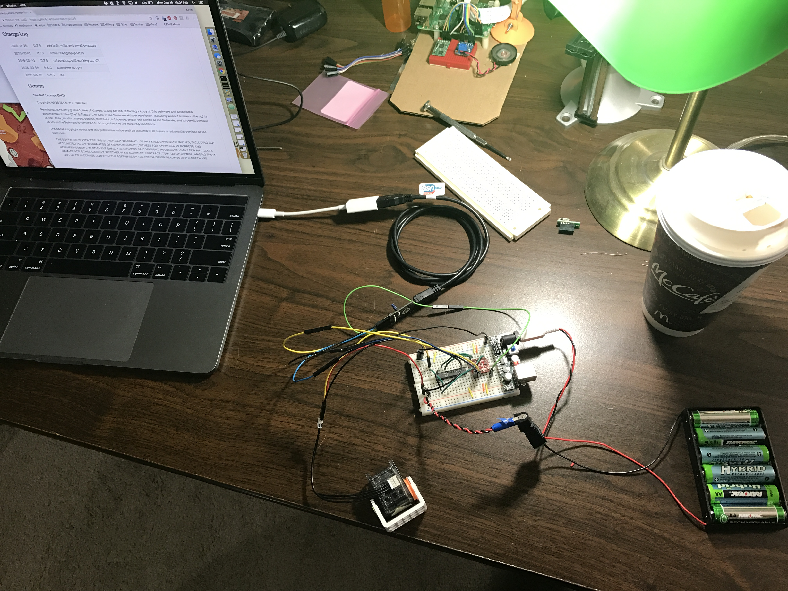
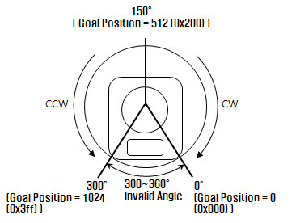
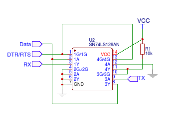
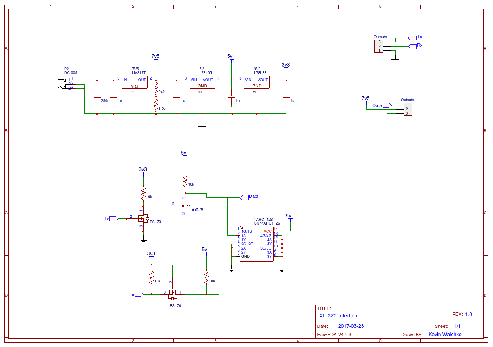

# Hardware Interface

The xl-320 servos use a half duplex, single master, multi-slave
serial interface between all of the servos. There are multiple designs on the interweb
you can build (or buy) to connect a computer or microcontroller to the servos.

# Current

I use a Sparkfun USB-to-serial port with 5V TTL. This allows me to also use
the Bluetooth modem in the RPi. Then interface with a modified Robotis solution
as shown above. Note: Data is the signal to/from the servo, TX is transmit,
RX is receive, and DTR/RTS is either one of those (not both) signals to control data
direction.

- Keep Bluetooth
- No logic level conversion
- For debugging/dev I can plug the USB serial into my Macbook and develop

# History

I have played around with **many** different ways to interface with the xl-320.
They all have pro's and con's.

| Method | Notes |
|---|---|
| Robotis Suggested | Requires an signal for data direction |
| 74LS241 | Has the NOT built into the chip w/ tri-state buffers, but only comes in a 20 pin DIP ... large foot print |
| Pixl | Simple, use TX as your direction, but you can get an echo on the RX signal. Software will filter  it out. |
| My way | I use the Robotis method, but removed the NOT gate and created one out of extra 74LS126 input. I use DTR (or RTS ... I just toggle both of them) as the data direction. |

## Serial Ports

- Raspberry Pi Serial port:
    - The RPi's serial port is 3.3V while the servos communicate at 5V, so you
	  have to use 3.3V to 5V shifting on the RX/TX lines
	- The RPi 3 serial port isn't a good serial port and will change data rate on
	  you based on the clock speed (which changes if it gets too hot). This can
	  lead to problems.
	      - The good serial port (clock independent) is tied to the Bluetooth
		    modem, you can go through a painful process to disable the Bluetooth
			modem and make it available. However, you loose Bluetooth (which I
			find useful).
- USB serial port:
    - This seems unnecessary since the RPi already has a serial port, but see the
	  issues above
	- I am now using a USB serial port with logic levels at 5V and I am avoiding
	  extra parts for logic level conversion.
	- I get to keep my Bluetooth which I use for other things
	- However,  this adds bulk ... even though the board is small, the USB cable
	  isn't
	- **Don't** be tempted to get a cheap USB device, make sure it is an FTDI so
	  you don't have to worry about driver. I messed with that for a little bit
	  and it was a pain. Linux support is said, until you dig around and find
	  out it is for Kernels 2.x and 3.x and currently linux is at 4.x. $7 down
	  the drain ... thanks Sparkfun, way to understand your products!

## Robotis Suggested

This uses a 74HC126 tri-state buffer to interconnect the data line with a standard UART.
To switch between the Tx and Rx signals, a third signal (direction port) is used. In my
software, I use the `pyserial` RTS signal for the direction signal. **Unfortunately,
not all USB serial interfaces breakout the RTS pin**

## 74LS241 Interface

I have used the [74LS241](http://savageelectronics.blogspot.com/2011/01/arduino-y-dynamixel-ax-12.html)
to talk to the xl-320. This has a higher pin count, but the NOT is included in the chip. It works, but
requires the extra RTS pin of the serial port to toggle direction.

## Modified Pixl

The [Poppy Project](https://www.poppy-project.org) designed an ingenious board call [Pixl](https://github.com/poppy-project/pixl)
that allows a standard UART (without the extra direction pin) to talk to the servos.
This is the hardware design I am currently using.

I was using a 74AHCT126 tri-state buffer with a Vcc of 5V. Now, this is more than an interface, it also produces all of the necessary voltages
(3.3V, 5V, and 7.5V) needed to talk to the servo. I use this one for debugging and
software development of `pyxl320` when I am on my Macbook.

## What Happened to the Raspberry Pi GPIO Version

An earlier version of my library used the RPi's GPIO pin 17 as the direction pin when
I used the 74LS241 chip above. It worked, but once I switched the Pixl interface, it
became redundant. Since I didn't need it any more, I removed it. If you use a standard
USB-to-serial converter or the RPi's UART, **you don't need GPIO if you use the Pixl
circuit** shown above.

# References

- [Mosfet logic level converter tutorial](https://learn.sparkfun.com/tutorials/bi-directional-logic-level-converter-hookup-guide)
- [Adjustable voltage calculator](http://www.reuk.co.uk/wordpress/electric-circuit/lm317-voltage-calculator/)

---

	
	 This work is licensed under a <a rel="license" href="http://creativecommons.org/licenses/by-sa/4.0/">Creative Commons Attribution-ShareAlike 4.0 International License</a>.

