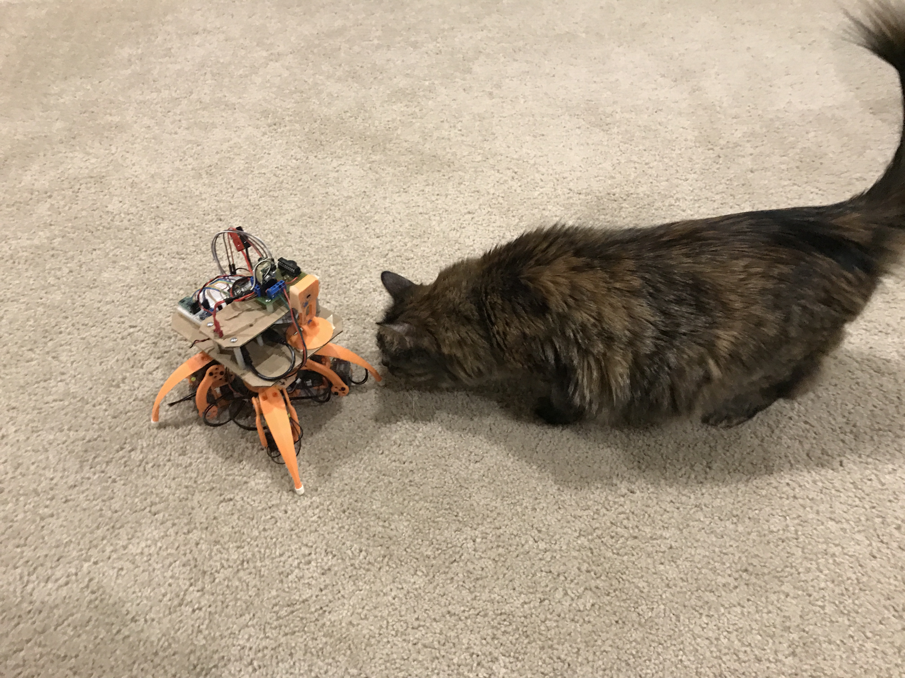

# Robots

Here are some robots I know of that have used this code.

## International School of Geneva

Here is their robot submission to [PiWars 2017 in Cambridge](http://libraries.ecolint.ch/chasci/?p=985)

## Walking Eye

My quadruped robot.

* [YouTube](https://www.youtube.com/watch?v=kH2hlxUfCNg)
* [Vimeo](https://player.vimeo.com/video/194676675)

